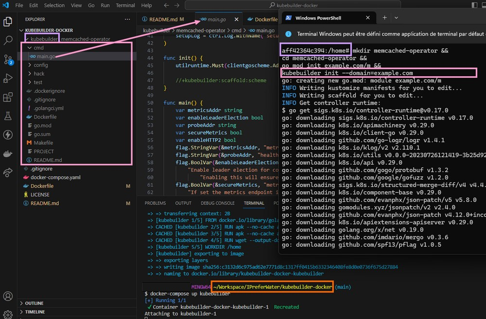

# Context

[kubebuilder](https://book.kubebuilder.io) doesn't support windows ([issue open](https://github.com/kubernetes-sigs/kubebuilder/issues/2940)), it's possible to use it without WSL using only Docker

[Kubebuilder](https://book.kubebuilder.io) currently lacks native support for Windows ([issue #2940](https://github.com/kubernetes-sigs/kubebuilder/issues/2940)). However, a workaround exists, allowing you to utilize Kubebuilder without WSL by leveraging Docker.

## Explanation

1. **Dockerfile Configuration:**
   - A Dockerfile is provided with Kubebuilder included.

2. **Docker-Compose Integration:**
   - Docker-Compose is utilized to mount the local volume to `/home` in the container. If you prefer not to use Docker-Compose, you can start the container using the `-v` option.

```
docker run -it -v $(pwd)/kubebuilder:/home your-image-name:your-image-tag tail -f /dev/null
```

This command initializes a container, linking your local directory to the container's /home directory, allowing seamless interaction with Kubebuilder on Windows.

## example from kubebuilder's quick start

1. **start the container**
```
docker-compose up
```

2. **go inside the container created**

```
docker exec -it <container_name_or_id> /bin/bash
```

3. **write the cmd from kubebuilder quick's start**
```
mkdir memcached-operator &&
cd memcached-operator &&
go mod init example.com/m &&
kubebuilder init --domain=example.com
```



<span style="color:purple;">local kubebuilder folder is bounded to /home of the container</span>
<span style="color:pink;">code generated on container can be seen on your local IDE</span>

```diff
- code generated on container can be seen on your local IDE
@@ local kubebuilder folder is bounded to /home of the container@@
```